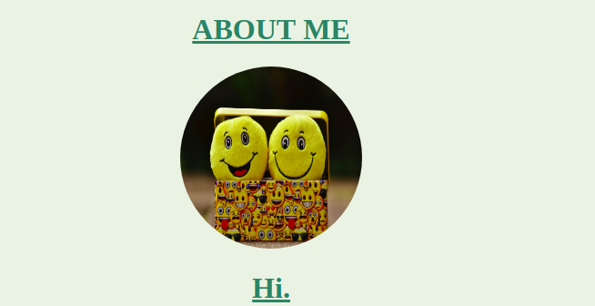
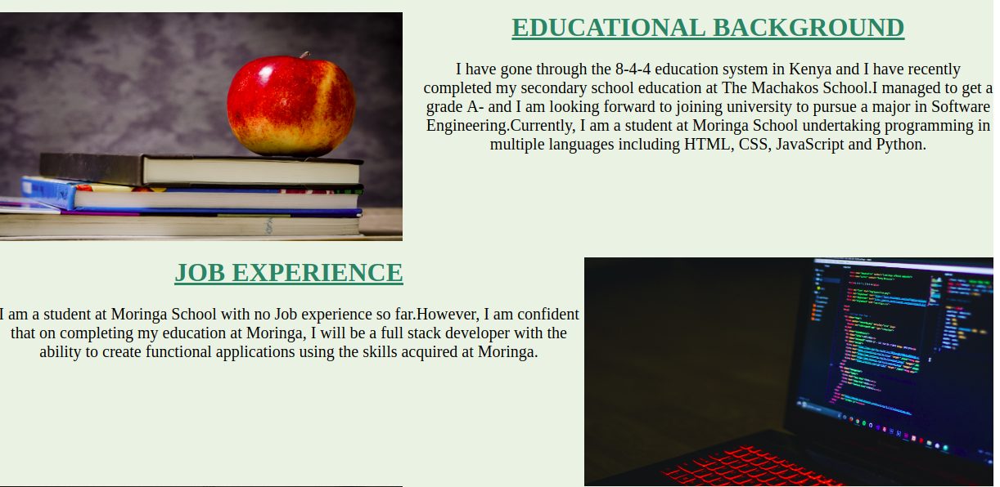
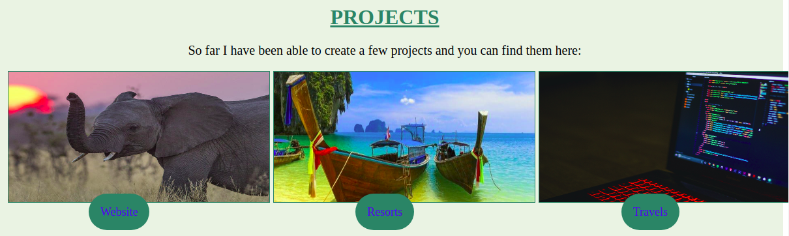

# A SIMPLE WEB PORTFOLIO
My name is John Muasa.A budding junior developer at moringa school.I am the sole developer and contributor in the development of this portfolio.

# PROJECT PURPOSE.
The project is intended to demonstrate my skills as a junior web developer in readiness to being a Full stack Professsional Developer.

# PROJECT LAYOUT
One the page has loaded, A background image will appear.Click on the **SEE MORE** button.

After that choose your options from the Navigation bar.

This brings you to the **About Me** section.

On scrolling downwards, you will see the main content.

Then move further down to the **Projects Section**

Finally, is the **contacts** session

# TECHNOLOGIES USED
The main technologies used were ***HTML*** and ***CSS***

# CONTACT INFORMATION
Reach me through my email address: <muasajohn01@gmail.com>
